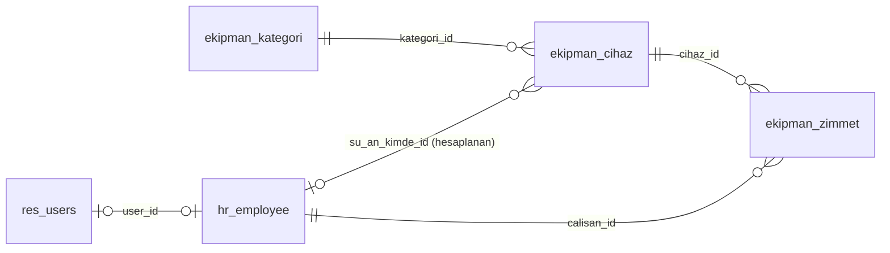
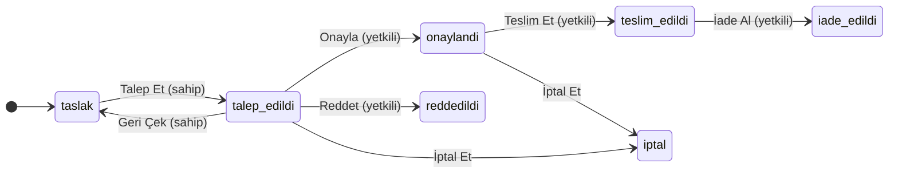

# Ekipman Zimmet Modülü

Mühendislerin ortak kullandığı ekipmanların (osiloskop, laptop, ölçüm cihazı) tarih aralıklı zimmet talebini, onayını, teslimini ve iadesini Odoo 18 Community üzerinde takip eden modül (`ekipman_zimmet`). Aynı cihazın çakışan tarihlerde iki kişiye verilmesini engeller; cihazın şu an kimde olduğunu, geçmişini ve iadesi geciken zimmetleri gösterir.

## 1. Kurulum

Ortam: Linux (Docker kullanılmadan), Odoo 18.0 kaynak kodu, Python sanal ortamı, aynı makinede PostgreSQL. Ayrıntılar ve karşılaşılan sorunlar: [`docs/kurulum-notlari.md`](docs/kurulum-notlari.md).

```
calisma_klasoru/
├── odoo/                          # Odoo 18.0 kaynağı
├── venv/
├── odoo.conf
└── ekipman-zimmet-case-study/     # bu depo (addons_path'e eklenir)
```

```bash
createuser -s odoo                                    # PostgreSQL kullanıcısı
git clone https://github.com/odoo/odoo.git --branch 18.0 --depth 1
python -m venv venv && source venv/bin/activate
pip install -r odoo/requirements.txt
git clone https://github.com/onurbcoban/ekipman-zimmet-case-study.git
cp ekipman-zimmet-case-study/odoo.conf.example odoo.conf   # addons_path ve db_* satırları düzenlenir

# Modülü demo verisiyle kur (mail ve hr bağımlılık olarak gelir), sonra sunucuyu başlat
./odoo/odoo-bin -c odoo.conf -d zimmet_db -i ekipman_zimmet --stop-after-init
./odoo/odoo-bin -c odoo.conf -d zimmet_db             # http://localhost:8069

# Otomatik testler (ayrı bir veritabanında)
./odoo/odoo-bin -c odoo.conf -d zimmet_test -i ekipman_zimmet --test-enable --test-tags /ekipman_zimmet --stop-after-init
```

**Debugger:** `ekipman-zimmet-case-study/.vscode/launch.json.example`, çalışma klasöründe `.vscode/launch.json` olarak kopyalanır; VS Code'da "Odoo 18: Zimmet" yapılandırması ile başlatılıp modül koduna breakpoint konur.

**Demo kullanıcıları** (parola kullanıcı adıyla aynıdır):

| Kullanıcı | Rol |
|---|---|
| `nehirsezgin`, `kaanbayrak` | Yetkili |
| `defnekaradut`, `tunaakgun`, `isiltezcan` | Mühendis |
| `admin` | Yetkili (komut satırından oluşturulan veritabanında parola `admin`) |

## 2. Veri modeli



| Model | Ana alanlar |
|---|---|
| `ekipman.kategori` | `name`, `description` |
| `ekipman.cihaz` | `name`, `etiket_no` (benzersiz), `seri_no`, `kategori_id`, `active`; hesaplanan: `fiziksel_durum` ve `su_an_kimde_id` (saklanan), `dolu_tarihler` |
| `ekipman.zimmet` | `name` (`ZMT/0001`), `state`, `cihaz_id`, `calisan_id`, `planlanan_baslangic/bitis`, `fiili_baslangic/bitis`, `red_gerekcesi`; chatter (`mail.thread`) |

Talep ve zimmet aynı kayıttır; kayıt durum değiştirerek talepten iadeye ilerler. Cihazın "kimde" bilgisi elle tutulmaz, zimmet kayıtlarından hesaplanır.

## 3. Süreç akışı



| Geçiş | Kim | Ön koşul |
|---|---|---|
| Talep Et | Talep sahibi | Başlangıç tarihi bugünden önce değil |
| Geri Çek | Talep sahibi | Talep onay bekliyor |
| Onayla | Yetkili | Aynı cihazın onaylı veya teslim edilmiş bir kaydıyla tarih çakışması yok |
| Reddet | Yetkili | Red gerekçesi dolu |
| Teslim Et | Yetkili | Bugün planlanan aralıkta; cihaz başka birinde değil |
| İade Al | Yetkili | — (fiili bitiş bugün yazılır) |
| İptal Et | Talep sahibi veya yetkili | Onay bekliyor veya onaylanmış (teslim edilmemiş) |
| Taslağı Sil | Talep sahibi | Taslak; taslaklar iptal edilmez, silinir |

Mühendis yalnızca kendi kayıtlarını görür; yetkili tüm kayıtları görür, onay, teslim, iade ve ekipman yönetimini yapar. "Gecikmiş" ayrı bir durum değil, teslim edilmiş ve planlanan bitişi geçmiş kayıttır; yetkili bunları "Gecikenler" menüsünde görür.

## 4. Tasarım kararları

Kodlar [`docs/kararlar.md`](docs/kararlar.md)'deki kararlara karşılık gelir; alternatifler ve ayrıntılı gerekçeler oradadır.

- **A0, A1 — Talep başına tek cihaz, tek model.** Talep ile zimmet aynı yaşam döngüsü olduğu için tek modelde durum geçişleriyle tutulur; çakışma kuralı sade kalır. Birden çok cihaz için ayrı talep açılır.
- **A4 — Zimmet çalışana bağlıdır.** `hr` zorunlu kurulum; kişi `hr.employee`'dir. Kullanıcı yalnızca kendi adına talep açar.
- **C1 — Yalnızca onaylı ve teslim edilmiş kayıtlar takvimi bloklar.** Bekleyen talep kimseye hak vermez; aynı tarihe iki talep açılabilir, yalnızca biri onaylanır.
- **C3 — Kapalı aralık, aynı gün devir yok.** `Date` tipiyle saat bilgisi yoktur; basit ve açıklanabilir kural için ardışık zimmetler arasında bir gün boşluk kabul edilmiştir.
- **C4 — Onay plana, teslim fiziksel duruma bakar.** Gecikmiş cihaz yeni onayı durdurmaz, ama iade alınmadan başkasına teslim edilemez.
- **B4 — Erken teslim yok.** Erken teslim, onaylı başka bir talebin hakkını bozabilir; teslim yalnızca planlanan aralıkta yapılır.
- **B6 — Gecikme bir durum değil, türetilmiş koşuldur.** Bugünün tarihine bağlı bir durum zamanlanmış görev gerektirirdi; filtre her zaman günceldir.
- **B7 — Yetkili kendi talebini onaylayabilir.** Yasak, tek yetkilili şirkette süreci tıkardı; onaylayan chatter'da izlenir.
- **B8, D5 — Yetki kontrolü sunucudadır.** Buton gizlemek yetki sağlamaz; durum ve fiili tarihler yalnızca geçiş metotlarıyla (`sudo`) yazılır, arayüz veya RPC ile doğrudan yazma hata verir.
- **D6 — "Kimde" ve geçmiş bilgisi yalnızca yetkiliye açık.** Mühendisin talep açmak için cihazın dolu tarihlerini bilmesi yeterlidir; bu bilgi isimsiz gösterilir.
- **G1 — Hazır bakım modülü kullanılmadı.** `maintenance` cihazı bir çalışana atar ama tarih aralıklı rezervasyon, onay akışı ve atama geçmişi sunmaz.

Kurulan modüller: yalnızca `mail` (chatter ve durum izleme) ve `hr` (çalışan modeli); diğerleri bunların bağımlılığı olarak gelir.

## 5. Kapsam dışı ve bilinen sınırlamalar

**Kapsam dışı:** çoklu cihazlı talep; başkası adına talep ve kullanıcısı olmayan personele zimmet; e-posta ve diğer bildirimler; zamanlanmış görevler; onaydan sonra geri alma; oluşturma anında çakışma uyarısı; eşzamanlı onaya karşı veritabanı kısıtı.

**Bilinen sınırlamalar:**
- Eşzamanlı iki onay, çok nadir de olsa çakışan iki onay üretebilir; çözüm yolu `docs/kararlar.md` C5'te belirlenmiştir.
- Ardışık zimmetler arasında en az bir gün boşluk kalır (C3).
- İade kaydı geç girilirse kayıttaki tarih gerçek tarihten geç olur; geçmişe dönük düzeltme yoktur (A2).
- Bekleyen talepler dolu tarihlerde görünmez; onay sonrası çakışan talepler otomatik reddedilmez (E4, C1).
- Üzerinde cihaz olan çalışanın arşivlenmesi engellenmez (A5).

## Belgeler

- [`docs/kararlar.md`](docs/kararlar.md) — tüm tasarım kararları, alternatifler ve gerekçeler
- [`docs/test-senaryolari.md`](docs/test-senaryolari.md) — test senaryoları ve otomatik testlerle eşlemesi
- [`docs/kurulum-notlari.md`](docs/kurulum-notlari.md) — kurulum ortamı, sorunlar ve çözümleri
- [`docs/egitim-dokumani.md`](docs/egitim-dokumani.md) — kullanıcılar için eğitim dokümanı
