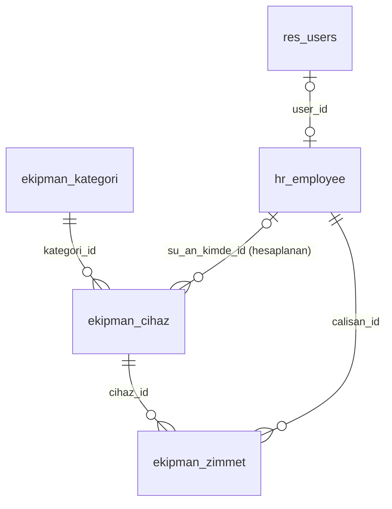
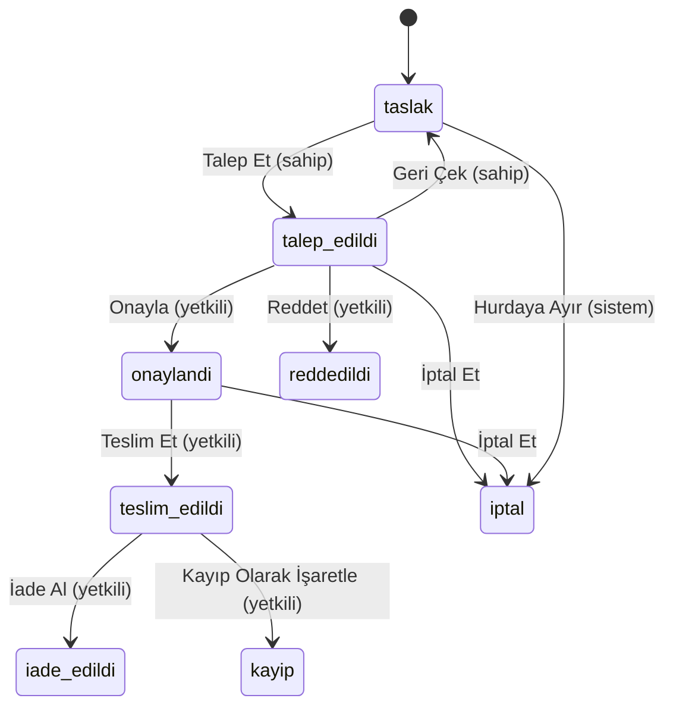

# Ekipman Zimmet Modülü

Mühendislerin ortak kullandığı ekipmanların (osiloskop, laptop, ölçüm cihazı) tarih aralıklı zimmet talebini, onayını, teslimini ve iadesini Odoo 18 Community üzerinde takip eden modül (`ekipman_zimmet`). Aynı cihazın çakışan tarihlerde iki kişiye verilmesini engeller; cihazın kimde olduğunu, geçmişini, geciken iadeleri ve kontrol, bakım, kayıp, hurda durumlarını gösterir.

## 1. Kurulum

Ortam: Linux (Docker yok), Odoo 18.0 kaynak kodu, Python sanal ortamı, yerel PostgreSQL. Ayrıntılar ve karşılaşılan sorunlar: [`docs/kurulum-notlari.md`](docs/kurulum-notlari.md).

```
calisma_klasoru/
├── odoo/                          # Odoo 18.0 kaynağı
├── venv/
├── odoo.conf
└── ekipman-zimmet-case-study/     # bu depo (addons_path'e eklenir)
```

```bash
createuser -s odoo                                    # PostgreSQL kullanıcısı
git clone https://github.com/odoo/odoo.git --branch 18.0 --depth 1
python -m venv venv && source venv/bin/activate
pip install -r odoo/requirements.txt
git clone https://github.com/onurbcoban/ekipman-zimmet-case-study.git
cp ekipman-zimmet-case-study/odoo.conf.example odoo.conf   # addons_path ve db_* satırları düzenlenir

# Modülü demo verisiyle kur (mail ve hr bağımlılık olarak gelir), sonra sunucuyu başlat
./odoo/odoo-bin -c odoo.conf -d zimmet_db -i ekipman_zimmet --stop-after-init
./odoo/odoo-bin -c odoo.conf -d zimmet_db             # http://localhost:8069

# Otomatik testler (ayrı bir veritabanında)
./odoo/odoo-bin -c odoo.conf -d zimmet_test -i ekipman_zimmet --test-enable --test-tags /ekipman_zimmet --stop-after-init
```

**Debugger:** `ekipman-zimmet-case-study/.vscode/launch.json.example`, çalışma klasörüne `.vscode/launch.json` olarak kopyalanır; VS Code'da "Odoo 18: Zimmet" yapılandırmasıyla başlatılır.

**Demo kullanıcıları** (parola kullanıcı adıyla aynıdır):

| Kullanıcı | Rol |
|---|---|
| `nehirsezgin`, `kaanbayrak` | Yetkili |
| `defnekaradut`, `tunaakgun`, `isiltezcan` | Mühendis |
| `admin` | Yetkili (komut satırıyla kurulan veritabanında parola `admin`) |

## 2. Veri modeli



| Model | Ana alanlar |
|---|---|
| `ekipman.kategori` | `name`, `description` |
| `ekipman.cihaz` | `name`, `etiket_no` (benzersiz), `aciklama`, `seri_no`, `kategori_id`, `active`, `kullanilabilirlik`; chatter; hesaplanan: `fiziksel_durum` ve `su_an_kimde_id` (saklanan), `dolu_tarihler` |
| `ekipman.zimmet` | `name` (`ZMT/0001`), `state`, `cihaz_id`, `calisan_id`, `planlanan_baslangic/bitis`, `fiili_baslangic/bitis`, `red_gerekcesi`, `iptal_nedeni`, `istenen_bitis`, `kullanici_geri_bildirimi`, `kapanis_notu`, `kapanis_tarihi`, `toplu_ref` (`TPL/0001`); chatter |
| `ekipman.zimmet.toplu` (geçici) | `cihaz_ids`, `planlanan_baslangic/bitis`: Toplu Talep sihirbazı |

Talep ve zimmet aynı kayıttır; durum değiştirerek talepten iadeye ilerler. "Kimde" bilgisi zimmet kayıtlarından hesaplanır.

## 3. Süreç akışı



| İşlem | Kim | Ön koşul / sonuç |
|---|---|---|
| Talep Et | Talep sahibi | Başlangıç bugün veya sonra; cihaz kullanılabilir |
| Geri Çek | Talep sahibi | Talep onay bekliyor |
| Onayla | Yetkili | Bitiş bugün veya sonra; cihaz kullanılabilir; onaylı veya teslim edilmiş kayıtla çakışma yok |
| Reddet | Yetkili | Red gerekçesi dolu |
| Teslim Et | Yetkili | Bugün planlanan aralıkta; cihaz kullanılabilir ve başkasında değil |
| İade Al | Yetkili | Fiili bitiş bugün yazılır; cihaz kontrole girer |
| Kayıp Olarak İşaretle | Yetkili | İade / kayıp notu dolu; cihaz kayıp olur |
| İptal Et | Talep sahibi veya yetkili | Onay bekliyor veya onaylı; iptal nedeni dolu |
| Taslağı Sil | Talep sahibi | Taslak iptal edilmez, silinir |
| Süre uzatma | Sahip ister (İstenen Bitiş), yetkili onaylar veya reddeder | Onaylı veya teslim edilmiş; yeni bitiş mevcut bitişten sonra, geçmişte değil; cihaz kullanılabilir; çakışma yok |
| Toplu Talep | Mühendis veya yetkili | Her cihaza ayrı talep açılıp gönderilir; biri geçersizse hiçbiri açılmaz |
| Toplu onay | Yetkili | Seçili kayıtlar birlikte onaylanır |
| Cihaz işlemleri | Yetkili | Kontrol Tamamlandı, Bakıma Al, Kullanılabilir Yap, Kayıp Olarak İşaretle, Bulundu; cihaz zimmette değil |
| Hurdaya Ayır | Yetkili | Cihaz zimmette değil; açık talepler aşamaya göre nedenle iptal edilir, cihaz arşivlenir |

Mühendis yalnızca kendi kayıtlarını görür; yetkili hepsini görür ve işleri "Bekleyen İşler" menüsünden yürütür. "Gecikmiş" bir durum değil, planlanan bitişi geçmiş teslim edilmiş kayıttır ("Gecikenler" menüsü).

## 4. Tasarım kararları

Alternatifler ve gerekçeler: [`docs/kararlar.md`](docs/kararlar.md).

- **A0, A1 — Talep başına tek cihaz, tek model.** Talep ve zimmet aynı yaşam döngüsüdür; tek modelde çakışma kuralı sade kalır.
- **A4 — Zimmet çalışana bağlıdır.** Kişi `hr.employee`'dir; kullanıcı yalnızca kendi adına talep açar.
- **C1 — Yalnızca onaylı ve teslim edilmiş kayıtlar takvimi bloklar.** Bekleyen talep hak vermez; aynı tarihe iki talep açılabilir, biri onaylanır.
- **C3 — Kapalı aralık, aynı gün devir yok.** `Date` saat taşımaz; ardışık zimmetler arasında bir gün boşluk kalır.
- **C4 — Onay plana, teslim fiziksel duruma bakar.** Gecikmiş cihaz yeni onayı durdurmaz, ama iade alınmadan teslim edilemez.
- **B4 — Erken teslim yok.** Onaylı başka bir talebin hakkını bozabilir.
- **B6 — Gecikme durum değil, türetilmiş koşuldur.** Tarihe bağlı bir durum zamanlanmış görev gerektirirdi; filtre hep günceldir.
- **B9 — Süre uzatma ayrı durum değil.** "İstenen Bitiş" alanının dolu olmasıdır; onaylanırsa bitiş ilerler ve çakışma kuralından geçer. Gecikmiş kayıt da uzatılabilir.
- **A6 — Toplu talep bir sihirbazdır.** Seçilen her cihaz için tek tek talebin kurallarıyla ayrı kayıt açılır; kayıtları yalnızca bir referans bağlar, yetkili gruplu görür ve birlikte onaylayabilir.
- **A7 — Kullanılabilirlik fiziksel durumdan ayrıdır.** Yalnızca kullanılabilir cihaz talep edilir, onaylanır ve teslim edilir; her iade cihazı kontrole alır. Kontrol, bakım ve kayıp mevcut talepleri korur (uyarı bandıyla); hurda açık talepleri nedeniyle iptal eder.
- **B10 — Kayıp ayrı bir kapanış durumudur.** Kaybı "iade" saymak geçmişi yanıltırdı; mühendisin geri bildirimi ve yetkilinin notu kontrolde görünür.
- **B7 — Yetkili kendi talebini onaylayabilir.** Yasak, tek yetkilili şirkette süreci tıkardı; onaylayan chatter'da görünür.
- **B8, D5 — Yetki kontrolü sunucudadır.** Buton gizlemek yetki değildir; durum, fiili tarihler ve kullanılabilirlik yalnızca işlem metotlarıyla (`sudo`) yazılır.
- **C5 — Eşzamanlılığa karşı veritabanı kısıtları.** Python kontrolü aynı anda yapılan iki onayı göremez; çakışma ve tek-teslim kuralları ertelenmiş `EXCLUDE` kısıtlarıyla da korunur (eklentisiz).
- **D6 — "Kimde" ve geçmiş yalnızca yetkiliye açık.** Mühendise dolu tarihler isimsiz gösterilir.
- **G1 — Hazır bakım modülü kullanılmadı.** `maintenance` tarih aralıklı rezervasyon, onay akışı ve atama geçmişi sunmaz.

Kurulan modüller: yalnızca `mail` (chatter) ve `hr` (çalışan); diğerleri bunların bağımlılığıdır.

## 5. Kapsam dışı ve bilinen sınırlamalar

**Kapsam dışı:** başkası adına talep ve kullanıcısı olmayan personele zimmet; e-posta ve diğer bildirimler; zamanlanmış görevler; onaydan sonra geri alma; oluşturma anında çakışma uyarısı; çalışan formunda "Zimmetler" butonu; toplu talebin bir bütün olarak onaylanması veya reddedilmesi (kayıtlar tek tek işler).

**Bilinen sınırlamalar:**
- Ardışık zimmetler arasında en az bir gün boşluk kalır (C3).
- İade geç işlenirse kayıttaki tarih de geç olur; geriye dönük düzeltme yok (A2).
- Bekleyen talepler dolu tarihlerde görünmez; onaydan sonra çakışan talepler otomatik reddedilmez (E4, C1).
- Kontrol veya bakımdaki cihazın talepleri iptal edilmez; mühendis uyarı bandından, yetkili kuyruktan izler (A7).
- Bildirim yok; kullanıcı değişikliği kaydında görür, kapanan talepler bir hafta "Güncel Talepler"de kalır (B3, E3).
- Toplu onayda çakışan tek kayıt tüm seçimi geri alır (A6).
- Üzerinde cihaz olan çalışanın arşivlenmesi engellenmez (A5).

## Belgeler

- [`docs/kararlar.md`](docs/kararlar.md) — tasarım kararları, alternatifler ve gerekçeler
- [`docs/test-senaryolari.md`](docs/test-senaryolari.md) — test senaryoları ve otomatik testlerle eşlemesi
- [`docs/kurulum-notlari.md`](docs/kurulum-notlari.md) — kurulum ortamı, sorunlar ve çözümleri
- [`docs/egitim-dokumani.md`](docs/egitim-dokumani.md) — kullanıcılar için eğitim dokümanı
- [`docs/gecis-plani.md`](docs/gecis-plani.md) — v1'den v2'ye geçişin fazları ve faz notları
