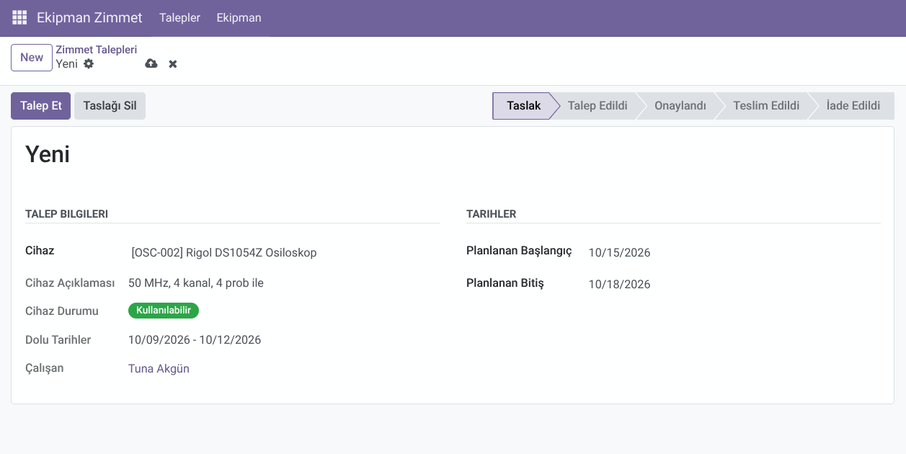
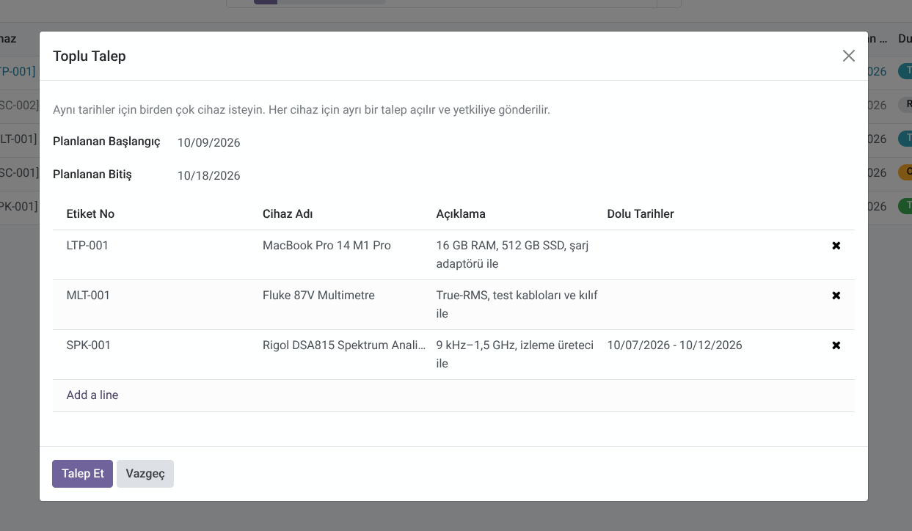
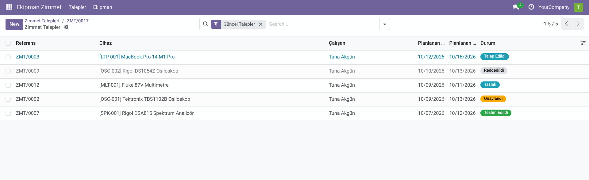
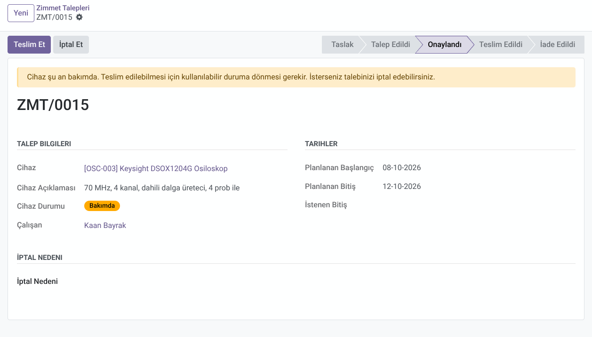
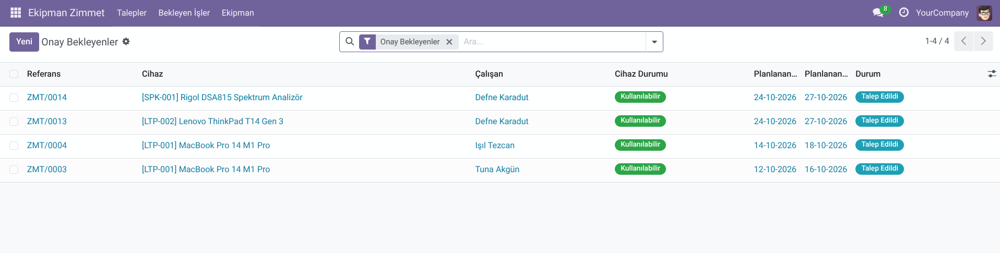
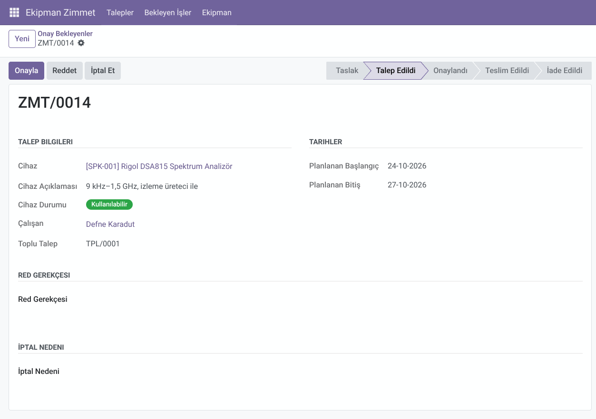
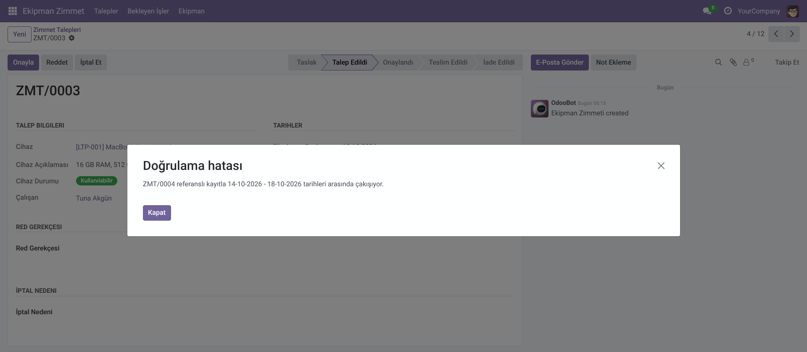
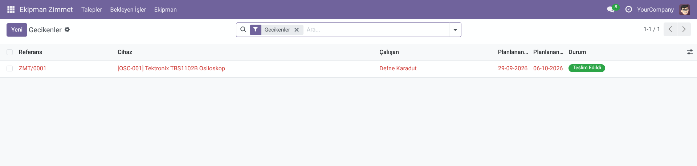
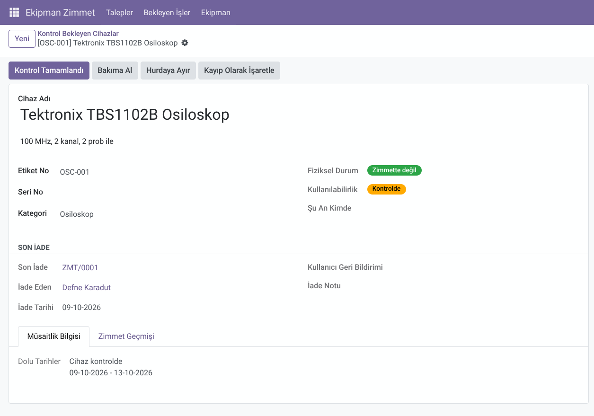
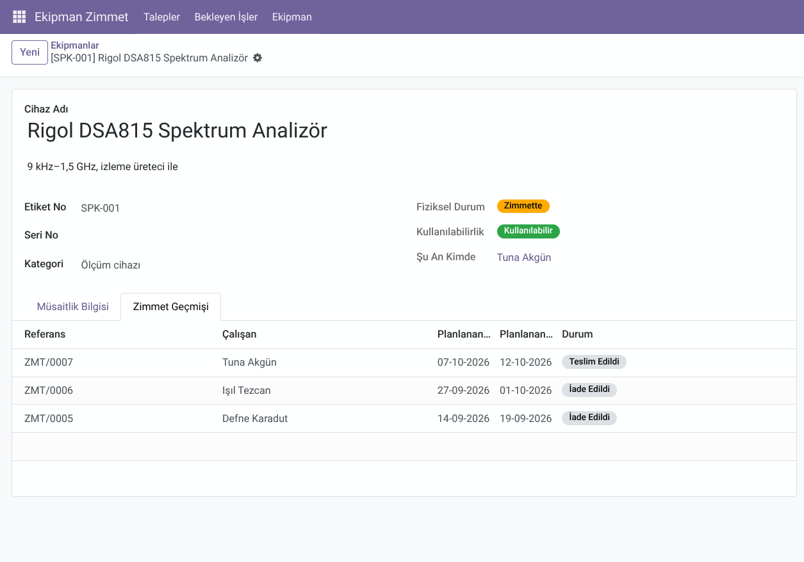

# Ekipman Zimmet — Kullanıcı Eğitim Dokümanı

Bu doküman, Ekipman Zimmet uygulamasını günlük işinde kullanacak mühendisler ve yetkililer içindir. Teknik bilgi gerektirmez.

## 1. Uygulama ne işe yarar?

Şirketteki ortak ekipmanlar (osiloskop, dizüstü bilgisayar, ölçüm cihazları) belirli tarihler için bir kişiye zimmetlenir. Uygulama bu süreci baştan sona takip eder: cihazın istenmesi, onaylanması, teslim edilmesi ve iade alınması. Böylece:

- Bir cihazın şu an kimde olduğu her zaman bilinir.
- Aynı cihaz aynı tarihler için iki kişiye verilemez.
- İade tarihi geçmiş cihazlar listede hemen görünür.
- Kontrolde, bakımda veya kayıp olan cihaz istenemez; durumu herkese görünür.

İki rol vardır:

| Rol | Ne yapar |
|---|---|
| **Mühendis** | Kendi adına cihaz talep eder, talebini takip eder. |
| **Yetkili** | Talepleri onaylar veya reddeder, cihazı teslim eder ve iade alır, ekipmanları tanımlar, iade edilen cihazları kontrol eder. Yetkili, mühendisin yapabildiği her şeyi de yapabilir. |

## 2. Temel kavramlar

**Talep (zimmet kaydı):** Bir cihazın belirli tarihler arasında size verilmesi isteği. Her talep tek bir cihaz içerir ve `ZMT/0001` gibi bir referans numarası alır. Talep, cihaz iade edilene kadar aynı kayıt üzerinde ilerler.

**Talebin aşamaları:** Formun sağ üstündeki durum çubuğunda talebin hangi aşamada olduğu görünür.

| Aşama | Anlamı | Sıradaki adım |
|---|---|---|
| **Taslak** | Talep hazırlanıyor, henüz gönderilmedi. | Mühendis "Talep Et"e basar. |
| **Talep Edildi** | Yetkilinin onayını bekliyor. | Yetkili onaylar veya reddeder. |
| **Onaylandı** | Tarihler size ayrıldı, cihaz henüz verilmedi. | Planlanan tarihte yetkili cihazı teslim eder. |
| **Teslim Edildi** | Cihaz sizde. | Bitiş tarihinde cihazı yetkiliye iade edersiniz. |
| **İade Edildi** | Cihaz geri alındı; süreç tamamlandı. | — |
| **Kayıp** | Cihaz sizdeyken kayboldu; yetkili kaydı kayıp olarak kapattı. | — |
| **Reddedildi** | Yetkili talebi kabul etmedi; gerekçesi formda yazar. | Gerekirse yeni talep açılır. |
| **İptal** | Talep iptal edildi; nedeni formda yazar. | — |

**Planlanan ve fiili tarihler:** Planlanan tarihler talep ederken sizin seçtiğiniz tarihlerdir. Fiili tarihler, cihazın gerçekten verildiği ve geri alındığı günlerdir; yetkili "Teslim Et" ve "İade Al" butonlarına bastığında sistem tarafından otomatik yazılır.

**Dolu tarihler:** Bir cihazın onaylanmış veya şu an birinde olan tarih aralıkları. Talep oluştururken cihazı seçtiğinizde formda görünür; böylece cihazın hangi günler boş olduğunu talep göndermeden önce görebilirsiniz. Kimin kullandığı gösterilmez.

**Cihaz durumu (kullanılabilirlik):** Cihazın şu an verilebilir olup olmadığını gösterir: **Kullanılabilir**, **Kontrolde** (iade edildi, yetkili kontrol ediyor), **Bakımda**, **Kayıp** veya **Hurda**. Yalnızca kullanılabilir cihaz talep edilebilir. Her iade edilen cihaz önce kontrole girer.

**Gecikmiş zimmet:** Teslim edilmiş ve planlanan bitiş tarihi geçmiş, ama henüz iade edilmemiş kayıt. Listelerde kırmızı görünür.

## 3. Mühendis için

### Talep oluşturma

1. **Talepler → Zimmet Talepleri** menüsünü açın ve **Yeni**'ye basın.
2. **Cihaz** alanından istediğiniz cihazı seçin. Listede yalnızca kullanılabilir cihazlar çıkar. Cihazlar etiket numarası ve adıyla listelenir (ör. "[LTP-001] MacBook Pro 14 M1 Pro"); seçtiğiniz cihazın açıklaması (ör. "16 GB RAM, 512 GB SSD, şarj adaptörü ile") hemen altında görünür. Altında ayrıca **Dolu Tarihler** görünür; seçeceğiniz tarihlerin bu aralıklarla çakışmamasına dikkat edin.
3. **Planlanan Başlangıç** ve **Planlanan Bitiş** tarihlerini girin. **Çalışan** alanı sizin adınızla otomatik dolar, değiştirilemez.
4. Kaydedin. Talep **Taslak** olarak saklanır; bu aşamada istediğiniz kadar düzenleyebilirsiniz.
5. Hazır olduğunuzda **Talep Et**'e basın. Talep **Talep Edildi** aşamasına geçer ve yetkiliye ulaşır.

*Şekil 1: Mühendis hesabıyla taslak bir talep formu: cihaz, dolu tarihler, planlanan tarihler ve "Talep Et" butonu.*

### Birden çok cihazı birlikte isteme (Toplu Talep)

Aynı tarihler için birden fazla cihaza ihtiyacınız varsa (ör. bir osiloskop ve bir dizüstü bilgisayar) **Talepler → Toplu Talep**'i açın. Planlanan tarihleri girin, **Satır ekle** ile cihazları seçin (listede yalnızca kullanılabilir cihazlar, dolu tarihleriyle görünür) ve **Talep Et**'e basın. Her cihaz için ayrı bir talep açılır ve doğrudan yetkiliye gönderilir; talepler aynı **Toplu Talep** numarasını (ör. `TPL/0002`) taşır. Cihazlardan biri için talep açılamıyorsa (ör. başlangıç tarihi geçmişse) hiçbiri açılmaz; mesajı okuyup düzeltin.

Talepler açıldıktan sonra birbirinden bağımsızdır: biri onaylanırken diğeri reddedilebilir; birini geri çekip düzeltebilir veya iptal edebilirsiniz.

*Şekil 2: Toplu Talep sihirbazı: planlanan tarihler, seçilen cihazlar ve dolu tarihleri, "Talep Et" butonu.*

### Talebi düzeltme, geri çekme ve iptal

- **Gönderdiğiniz talepte hata varsa:** Talep henüz onaylanmadıysa **Geri Çek**'e basın. Talep tekrar **Taslak** olur; düzeltip yeniden **Talep Et**'e basın.
- **Onaylanmış talep düzenlenemez.** Tarih değişikliği gerekiyorsa talebi iptal edip yenisini açın.
- **İptal Et:** Onay bekleyen veya onaylanmış (henüz teslim edilmemiş) talebinizi iptal edebilirsiniz. Önce formdaki **İptal Nedeni** alanını doldurun (ör. "Artık ihtiyacım kalmadı."), sonra **İptal Et**'e basın; neden boşken iptal yapılamaz. Onaylı bir talebi iptal etmek, o tarihleri başkalarının kullanımına açar; ihtiyacınız kalmadıysa iptal etmeniz rica edilir.
- **Taslağı Sil:** Hiç gönderilmemiş bir taslaktan vazgeçtiyseniz formdaki **Taslağı Sil**'e basın; onayınız sorulur ve taslak kalıcı olarak silinir. Taslaklar iptal edilmez, silinir. Gönderilmiş talepler geçmiş kaydı olarak kalır; iptal edilir ama silinmez.

### Talebinizi takip etme

**Zimmet Talepleri** listesinde yalnızca kendi talepleriniz görünür. Liste varsayılan olarak **Güncel Talepler** filtresiyle açılır: açık talepleriniz ve son bir hafta içinde kapanmış (iade edilen, kayıp olarak kapatılan, reddedilen, iptal edilen) talepleriniz görünür. Böylece reddedilen veya iptal edilen bir talebinizi fark eder, nedenini formda okursunuz. Yalnızca açık talepleri görmek için arama çubuğundan **Açık Talepler**'i seçin; daha eski kapanmış talepler için filtreyi kaldırın. Satır renkleri: mavi = onay bekliyor, sarı = onaylanmış ama tarihi geçmiş (teslim edilmemiş), kırmızı = iadesi gecikmiş, soluk = tamamlanmış (iade, kayıp, red, iptal). Sütun ayarlarından isteğe bağlı **Cihaz Durumu** sütununu açabilirsiniz.

*Şekil 3: Mühendisin kendi talepleri listesi; farklı aşamalardaki talepler ve renkler.*

- **Reddedildiyse:** Talebi açın; yetkilinin yazdığı **Red Gerekçesi** formda görünür. Genellikle farklı tarihlerle yeni bir talep açmanız yeterlidir.
- **Onaylandıysa:** Planlanan başlangıç tarihinde cihazı yetkiliden alın. Yetkili teslimi sisteme işlediğinde talebiniz **Teslim Edildi** olur.
- **İade:** Planlanan bitiş tarihine kadar cihazı yetkiliye teslim edin. Yetkili iadeyi sisteme işler. Cihazı erken getirebilirsiniz; kalan günler başkalarının kullanımına açılır.
- **Formun altındaki kayıt geçmişi**, talebin kim tarafından ve ne zaman onaylandığını, teslim edildiğini gösterir.
- **Cihaz kontrole, bakıma veya kayba girdiyse:** Talebiniz iptal edilmez, olduğu yerde bekler; formun üstünde turuncu bir bant cihazın durumunu ve sıradaki adımı yazar (ör. "Cihaz şu an bakımda. Teslim edilebilmesi için kullanılabilir duruma dönmesi gerekir. İsterseniz talebinizi iptal edebilirsiniz."). Cihaz kullanılabilir olunca süreç kaldığı yerden sürer. Cihazın ne zaman döneceği bilinmez; acil ihtiyacınız varsa talebi iptal edip başka bir cihaz için talep açın.
- **Cihaz hurdaya ayrıldıysa:** Açık talepleriniz sistem tarafından iptal edilir; iptal nedeni hangi cihaz yüzünden ve hangi aşamada iptal edildiğini yazar. Bu talepler bir hafta **Güncel Talepler**'de görünür.

*Şekil 4: Cihazı bakımda olan onaylı bir talebin formu: üstte "Cihaz şu an bakımda…" uyarı bandı ve Cihaz Durumu alanı.*

### Cihazla ilgili sorun bildirme

Cihaz sizdeyken bir sorun fark ederseniz (ör. "Kanal 3 zaman zaman sinyal kaçırıyor.") talebinizi açıp **Notlar** bölümündeki **Kullanıcı Geri Bildirimi** alanına yazın ve kaydedin. İadeyi beklemenize gerek yok; not, cihaz iade edilip kontrole girdiğinde yetkiliye görünür.

### Süreyi uzatma

Cihaza planladığınızdan daha uzun süre ihtiyacınız varsa, talebiniz onaylandıktan sonra veya cihaz elinizdeyken uzatma isteyebilirsiniz:

1. Talebinizi açın ve **İstenen Bitiş** alanına yeni bitiş tarihini yazıp kaydedin. Yeni tarih mevcut bitişten sonra olmalı ve bugünden önce olamaz.
2. Formun üstünde "Uzatma isteği yetkili onayını bekliyor." bandı görünür. Ayrıca bir butona basmanız gerekmez.
3. Yetkili onaylarsa **Planlanan Bitiş** yeni tarihe güncellenir. Reddederse istenen tarih temizlenir ve formun altındaki kayıt geçmişinde reddedildiği yazar.
4. Vazgeçerseniz **Uzatmayı Geri Çek**'e basın.

İade tarihini kaçırdıysanız (cihaz hâlâ sizdeyse) de uzatma isteyebilirsiniz; onaylanırsa kaydınız geciken listesinden çıkar. Uzatma, aynı tarihlere başka biri için verilmiş bir onayla çakışıyorsa onaylanamaz.

### Ekipmanlara göz atma

**Ekipman → Ekipmanlar** menüsünde cihazları görebilirsiniz; liste varsayılan olarak **Kullanımdaki Cihazlar** filtresiyle açılır (kayıp ve hurda cihazlar gizlidir). **Kullanılabilirlik** sütunu cihazın verilebilir olup olmadığını, **Verilebilir** filtresi şu an kullanılabilir ve kimsede olmayan cihazları gösterir. **Fiziksel Durum** sütunu cihazın şu an birinde olup olmadığını ("Zimmette" / "Zimmette değil") gösterir. Cihazı açıp **Müsaitlik Bilgisi** sekmesinden dolu tarihlerine bakabilirsiniz. Cihazın kimde olduğu ve geçmiş kullanıcıları yalnızca yetkililere görünür.

## 4. Yetkili için

Yalnızca yetkililere görünen **Bekleyen İşler** menüsünde, günlük işinizi iş akışı sırasıyla gösteren listeler vardır. Her liste ilgili filtreyle açılır; filtre arama çubuğunda görünür ve kaldırılırsa tüm kayıtlar listelenir.

| Menü | İçindekiler | Yapılacak iş |
|---|---|---|
| **Onay Bekleyenler** | Gönderilmiş talepler | Onaylamak veya reddetmek |
| **Uzatma Bekleyenler** | Süre uzatma isteği olan talepler | Uzatmayı onaylamak veya reddetmek |
| **Teslim Bekleyenler** | Onaylanmış, cihazı henüz verilmemiş talepler | Cihazı verirken teslimi işlemek |
| **Gecikenler** | İade tarihi geçmiş zimmetler | Kişiyle iletişime geçmek, cihaz gelince iadeyi işlemek |
| **Süresi Geçmiş Onaylar** | Bitiş tarihi geçmiş ama hiç teslim edilmemiş onaylar | İptal etmek |
| **Kullanılamayan Cihaz Onayları** | Onaylanmış ama cihazı şu an kontrolde, bakımda veya kayıp olan talepler | Cihazı hazırlamak ya da talep sahibiyle konuşup iptal etmek |
| **Kontrol Bekleyen Cihazlar** | İade edilmiş, kontrol bekleyen cihazlar | Cihazı kontrol edip Kontrol Tamamlandı veya Bakıma Al demek |

**Onay Bekleyenler** ve **Kullanılamayan Cihaz Onayları** listelerinde **Cihaz Durumu** sütunu görünür; hangi talebin şu an onaylanabilir olduğunu listeden anlarsınız.

*Şekil 5: Yetkili hesabıyla "Onay Bekleyenler" listesi; arama çubuğundaki filtre etiketi.*

### Onaylama ve reddetme

1. **Onay Bekleyenler**'den talebi açın.
2. Uygunsa **Onayla**'ya basın. Sistem, aynı cihazın aynı tarihlerde onaylanmış başka bir talebi olup olmadığını kontrol eder; çakışma varsa onaya izin vermez ve çakışan talebin numarasını ve tarihlerini gösterir.
3. Uygun değilse **Red Gerekçesi** alanına nedenini yazın ve **Reddet**'e basın. Gerekçe boşken reddetme yapılamaz. Gerekçe, talep sahibine formda görünür; karar verildikten sonra değiştirilemez.

*Şekil 6: Onay bekleyen bir talebin formu: Onayla, Reddet ve Red Gerekçesi alanı.*

Aynı cihaz için aynı tarihlere iki ayrı talep gelebilir. Birini onayladığınızda diğeri kendiliğinden reddedilmez; onu gerekçe yazarak siz reddedersiniz (örneğin "Aynı tarihlerde başka bir talep onaylandı; lütfen farklı tarihlerle yeniden talep açın.").

*Şekil 7: Çakışan ikinci talep onaylanmaya çalışıldığında çıkan uyarı.*

Kendi talebinizi de onaylayabilirsiniz; işlem formun altındaki kayıt geçmişinde adınızla görünür.

**Toplu onay:** Listede birden çok talebi soldaki kutularla seçip üstte çıkan **Onayla**'ya basabilirsiniz. Toplu talepleri birlikte görmek için arama çubuğunda **Grupla → Toplu Talep**'i seçin. Seçilen taleplerden biri onaylanamıyorsa (ör. çakışma) hiçbiri onaylanmaz; mesaj takılan talebin numarasıyla başlar (ör. "ZMT/…: ZMT/… referanslı kayıtla … çakışıyor."). O talebi seçimden çıkarıp tekrar deneyin. Toplu red yoktur; red gerekçesi her talebe ayrı yazılır.

### Uzatma isteklerini onaylama

**Uzatma Bekleyenler**'den talebi açın; istenen yeni bitiş tarihi formda görünür. **Uzatmayı Onayla** planlanan bitişi yeni tarihe taşır; yeni tarihler aynı cihazın onaylı başka bir talebiyle çakışıyorsa sistem çakışan talebi göstererek onaya izin vermez. **Uzatmayı Reddet** isteği temizler ve kayıt geçmişine not düşer.

### Teslim etme ve iade alma

- **Teslim Et:** Cihazı fiziksel olarak verdiğiniz anda **Teslim Bekleyenler**'den talebi açıp **Teslim Et**'e basın. Fiili başlangıç tarihi bugün olarak yazılır. Teslim yalnızca planlanan tarih aralığı içinde yapılabilir; erken teslim yapılamaz.
- **Cihaz hâlâ başkasındaysa** (önceki kullanıcı iade etmediyse) teslim yapılamaz. Önce önceki kullanıcının iadesini alın; ardından teslimi işleyin.
- **İade Al:** Cihaz geri geldiği gün ilgili talebi (örneğin **Gecikenler**'den) açıp **İade Al**'a basın. Fiili bitiş tarihi bugün olarak yazılır. İadeyi cihazın geldiği gün işleyin; tarih sonradan geriye düzeltilemez. İlk gözleminizi (ör. "Kasada çizik var.") iade öncesi **İade / Kayıp Notu** alanına yazabilirsiniz. İade edilen cihaz kendiliğinden **Kontrolde** olur ve kontrol bitene kadar yeniden verilemez.
- **Kayıp Olarak İşaretle:** Cihaz kişideyken kaybolduysa önce **İade / Kayıp Notu**'na ne olduğunu yazın (zorunlu), sonra **Kayıp Olarak İşaretle**'ye basın. Kayıt **Kayıp** olarak kapanır, cihazın durumu **Kayıp** olur.

*Şekil 8: "Gecikenler" listesi; kırmızı satırlar.*

### Süresi geçmiş onaylar

Onaylanmış ama tarihi geçtiği halde hiç teslim edilmemiş talepler artık teslim edilemez. Bunları **Süresi Geçmiş Onaylar**'dan açıp iptal nedenini (ör. "Süresi geçti, teslim edilmedi.") yazarak **İptal Et** ile kapatın; kişinin hâlâ ihtiyacı varsa yeni tarihlerle talep açması gerekir.

### Kontrol, bakım, kayıp ve hurda

Bu işlemler cihaz formunun üstündeki butonlarladır; cihazın durumu başka yoldan değiştirilemez ve her değişiklik formun altındaki kayıt geçmişinde adınızla görünür. Cihaz birindeyken (zimmetteyken) bu işlemler yapılamaz; önce iade alınır.

- **Kontrol:** **Kontrol Bekleyen Cihazlar**'dan cihazı açın. **Son İade** bölümünde son iadenin talebi, iade eden, iade tarihi, kullanıcının geri bildirimi ve iade notu görünür. Cihaz sağlamsa **Kontrol Tamamlandı**'ya (cihaz kullanılabilir olur), sorun varsa **Bakıma Al**'a basın.
- **Bakım:** Kullanılabilir veya kontroldeki cihaz **Bakıma Al** ile bakıma alınır; bakım bitince **Kullanılabilir Yap**'a basın.
- **Kayıp:** Kimsede olmayan bir cihaz kaybolduysa cihaz formunda **Kayıp Olarak İşaretle**'ye basın. Kayıp cihaz bulunursa **Bulundu**'ya basın; cihaz kontrole girer ve **Son İade** bölümünde kayıp kaydı görünür.
- **Hurdaya Ayır:** Cihaz kalıcı olarak kullanılamayacaksa **Hurdaya Ayır**'a basın (onay sorulur, geri alınamaz). Cihazın taslak, onay bekleyen ve onaylı bütün talepleri nedeni yazılarak iptal edilir; cihaz **Hurda** olur ve arşivlenir. Hiçbir kayıt silinmez.

*Şekil 9: Kontroldeki bir cihazın formu: "Son İade" bölümü (iade eden, tarih, geri bildirim, iade notu) ve üstte Kontrol Tamamlandı / Bakıma Al butonları.*

Kontrol, bakım ve kayıp cihazın mevcut taleplerini iptal etmez; talepler cihaz kullanılabilir olunca kaldığı yerden sürer ve bu sürede **Kullanılamayan Cihaz Onayları**'nda görünür.

### Ekipman ve kategori tanımlama

- **Ekipman → Ekipmanlar → Yeni:** **Cihaz Adı** (herkesin tanıyacağı ad, ör. "MacBook Pro 14 M1 Pro"), **Etiket No** (cihazın üzerindeki demirbaş etiketi, ör. "LTP-001"), **Açıklama** (cihazı benzerlerinden ayıran ayrıntılar, ör. "16 GB RAM, 512 GB SSD, şarj adaptörü ile"), **Seri No** (isteğe bağlı) ve **Kategori** girilir. Etiket numarası her cihaz için farklı olmalıdır.
- **Ekipman → Kategoriler** menüsünden yeni kategori eklenebilir (örneğin "Osiloskop", "Dizüstü bilgisayar").
- **Ekipman → Lokasyonlar** menüsünden cihazların bağlı olduğu yerler tanımlanır (örneğin "Ar-Ge Laboratuvarı", "BT Deposu"); cihaz formundaki **Lokasyon** alanı, cihazın kullanılmadığında durduğu ve iade edildiği yeri gösterir.
- **Kullanımdan kaldırma:** Cihazı silmek yerine arşivleyin (form üzerindeki işlem menüsünden **Arşivle**). Geçmiş zimmet kaydı olan cihaz silinemez. Onaylı veya teslim edilmiş talebi olan cihaz arşivlenemez; önce o talepleri tamamlayın veya iptal edin. Arşivlenen cihazlar ekipman listesinde **Arşivlenenler** filtresiyle görülür. Cihaz bozulduğu veya ömrünü doldurduğu için kaldırılıyorsa arşivlemek yerine **Hurdaya Ayır**'ı kullanın; açık talepleri de nedeniyle kapatır.

### Cihaz şu an kimde, daha önce kimdeydi?

- **Ekipmanlar** listesindeki **Şu An Kimde** sütunu cihazın kimde olduğunu gösterir. **Zimmetteki Cihazlar** filtresi yalnızca şu an birinde olan cihazları listeler.
- Cihazı açtığınızda **Zimmet Geçmişi** sekmesi, cihazı daha önce teslim alan herkesi tarihleriyle gösterir.

*Şekil 10: Yetkili hesabıyla bir cihaz formu: "Şu An Kimde" alanı ve "Zimmet Geçmişi" sekmesi.*

## 5. Uyarı mesajları ve ne yapmalı

| Mesaj | Anlamı | Ne yapmalı |
|---|---|---|
| Çalışan profiliniz bulunmuyor. | Kullanıcı hesabınız bir çalışan kaydına bağlı değil. | Sistem yöneticisinden hesabınızı çalışan kaydınıza bağlamasını isteyin. |
| Bitiş tarihi, başlangıç tarihinden önce olamaz. | Tarihler ters girilmiş. | Tarihleri düzeltin. |
| Başlangıç tarihi geçmiş bir talep gönderilemez. Lütfen tarihleri güncelleyin. | Taslağın başlangıç tarihi bugünden önce. | Tarihleri bugün veya sonrası olacak şekilde düzeltip tekrar gönderin. |
| ZMT/… referanslı kayıtla … tarihleri arasında çakışıyor. | Cihaz bu tarihlerde başka bir onaylı talebe ayrılmış. | Talebi gerekçe yazarak reddedin; kişi farklı tarihlerle yeni talep açsın. |
| Reddetmek için red gerekçesi doldurulmalıdır. | Gerekçe alanı boş. | Red Gerekçesi alanını doldurup tekrar Reddet'e basın. |
| Teslimat yalnızca planlanan tarih aralığında yapılabilir. Erken veya süresi geçmiş teslimat yapılamaz. | Bugün, talebin planlanan aralığında değil. | Erkense başlangıç tarihini bekleyin; süresi geçmişse talebi iptal edin. |
| Bu cihaz şu anda başka bir çalışana teslim edilmiş durumdadır. Önce iade alınması gerekir. | Önceki kullanıcı cihazı henüz iade etmedi. | **Gecikenler**'den önceki kaydın iadesini alın, sonra teslimi işleyin. |
| Yalnızca … durumundaki kayıtlar onaylanabilir / teslim edilebilir / … | Kayıt, siz ekranı açtıktan sonra başka biri tarafından değiştirilmiş. | Sayfayı yenileyip talebin güncel aşamasına bakın. |
| Yalnızca taslak durumundaki kayıtlar silinebilir. | Gönderilmiş talepler silinemez. | Gerekirse **İptal Et** kullanın. |
| İptal etmek için iptal nedeni doldurulmalıdır. | İptal Nedeni alanı boş. | Nedeni yazıp tekrar **İptal Et**'e basın. |
| Yalnızca kendi taslaklarınızı silebilirsiniz. | Başka birinin taslağını silmeye çalıştınız. | Taslak, sahibi tarafından silinir; gönderildiğinde yetkili onaylayabilir veya reddedebilir. |
| Bu etiket numarasına sahip bir cihaz zaten mevcut! | Aynı etiket numarası başka bir cihazda var. | Farklı bir etiket numarası girin. |
| Geçmiş zimmet kaydı olan cihaz silinemez, arşivleyiniz. | Cihazın geçmişi korunmalı. | Cihazı arşivleyin. |
| Aktif zimmeti olan cihaz arşivlenemez. | Cihazın onaylı veya teslim edilmiş talebi var. | Önce talepleri tamamlayın veya iptal edin. |
| İstenen bitiş, mevcut bitiş tarihinden sonra olmalıdır. | Uzatma için daha erken veya aynı tarih girildi. | Daha ileri bir tarih girin; erken bırakmak için cihazı iade edin. |
| İstenen bitiş bugünden önce olamaz. | Uzatma için geçmiş bir tarih girildi. | Bugün veya sonrası bir tarih girin. |
| Uzatma yalnızca onaylı veya teslim edilmiş talepte istenebilir. | Talep henüz onaylanmamış veya kapanmış. | Onay bekleyen talepte tarihi düzeltmek için talebi geri çekin. |
| Cihaz şu an kontrolde / bakımda / kayıp; talep edilemez / gönderilemez / onaylanamaz / teslim edilemez. | Cihaz şu an verilebilir durumda değil. | Cihazın kullanılabilir olmasını bekleyin veya talebi iptal edip başka cihaz seçin. |
| Kayıp olarak işaretlemek için İade / Kayıp Notu yazılmalıdır. | Not alanı boş. | Ne olduğunu nota yazıp kaydedin, sonra tekrar deneyin. |
| Zimmetteki cihazın durumu değiştirilemez; önce iade alınmalıdır. | Cihaz şu an birinde. | Önce iadeyi alın; zimmetteyken kaybolduysa talep formundan **Kayıp Olarak İşaretle**'yi kullanın. |
| Kullanılabilirlik yalnızca cihaz formundaki işlemlerle değiştirilebilir. | Durum alanına doğrudan yazılmaya çalışıldı. | Cihaz formunun üstündeki butonları kullanın. |

## 6. Akılda tutulacak kurallar

- Her talep tek bir cihaz içerir; aynı tarihler için birden çok cihaz **Toplu Talep** ile tek seferde istenir.
- Onay bekleyen talepler tarihleri ayırmaz; tarihler ancak onaylandığında ayrılır. Aynı tarihlere birden fazla kişi talep açabilir, yalnızca biri onaylanır.
- Aynı cihaz için iki talebin tarihleri aynı günü paylaşamaz: bir talep ayın 10'unda bitiyorsa sonraki talep en erken 11'inde başlayabilir.
- Cihaz planlanan başlangıç tarihinden önce teslim edilemez; iade ise her zaman yapılabilir.
- Onaylanmış talep düzenlenemez; değişiklik için iptal edip yeni talep açılır.
- Teslim ve iade tarihleri sistem tarafından o günün tarihiyle yazılır ve sonradan değiştirilemez.
- Yalnızca kullanılabilir cihaz talep edilir, onaylanır ve teslim edilir. İade edilen her cihaz kontrole girer.
- Kontrol, bakım ve kayıp mevcut talepleri iptal etmez; hurda ise açık talepleri nedeniyle iptal eder.

## Ek: Demo verisiyle deneyin

Demo verisiyle kurulmuş bir veritabanında aşağıdaki adımlarla uygulamayı uçtan uca deneyebilirsiniz. Kullanıcıların parolası kullanıcı adıyla aynıdır. Talep numaraları, veritabanı sıfırdan kurulduğunda geçerlidir.

1. **Mühendis olarak talep:** `tunaakgun` ile girin. **Zimmet Talepleri**'nde **ZMT/0012** (multimetre, taslak) talebini açın ve **Talep Et**'e basın.
2. **Yetkili olarak onay, teslim ve iade:** `nehirsezgin` ile girin. **Onay Bekleyenler**'den ZMT/0012'yi **Onayla**'yın; **Teslim Bekleyenler**'den **Teslim Et**'e, ardından **İade Al**'a basın. Formun altındaki kayıt geçmişinde her adımı kimin yaptığını görün. İadeden sonra multimetre **Kontrol Bekleyen Cihazlar**'da görünür; açıp **Kontrol Tamamlandı**'ya basın.
3. **Çakışma:** Aynı kullanıcıyla **Onay Bekleyenler**'de dizüstü bilgisayar için çakışan iki talep vardır (ZMT/0003 ve ZMT/0004). Birini onaylayın; diğerini onaylamaya çalıştığınızda çakışma uyarısı çıkar.
4. **Uzatma:** **Uzatma Bekleyenler**'de iki istek vardır. ZMT/0007'nin (spektrum analizör) uzatmasını onaylayın: bitiş tarihi ilerler. ZMT/0001'in (osiloskop, gecikmiş) uzatmasını onaylamaya çalışın: aynı osiloskobun ZMT/0002 talebiyle çakıştığı için sistem izin vermez.
5. **Gecikmiş cihaz:** **Gecikenler**'de ZMT/0001'i (osiloskop, Defne) görün. **Teslim Bekleyenler**'deki ZMT/0002 aynı osiloskobun bugün başlayan talebidir; **Teslim Et**'e bastığınızda "Önce iade alınması gerekir" uyarısı çıkar. ZMT/0001'in iadesini aldıktan sonra osiloskop kontrole girer; **Kontrol Bekleyen Cihazlar**'dan açıp **Kontrol Tamamlandı**'ya bastığınızda ZMT/0002 teslim edilebilir.
6. **Süresi geçmiş onay ve red:** **Süresi Geçmiş Onaylar**'da ZMT/0010'u görün. Reddedilmiş ZMT/0009'u açıp red gerekçesini okuyun.
7. **Toplu talep:** **Onay Bekleyenler**'de **Grupla → Toplu Talep**'i seçin; Defne'nin `TPL/0001` toplu talebindeki iki kayıt (ZMT/0013 ve ZMT/0014) birlikte görünür. İkisini seçip **Onayla**'ya basın.
8. **Bakım ve kayıp:** **Kullanılamayan Cihaz Onayları**'nda bakımdaki osiloskobun (OSC-003) onaylı talebini açın: formun üstünde uyarı bandı vardır ve **Teslim Et** "Cihaz şu an bakımda; teslim edilemez." hatası verir. **Ekipmanlar**'da filtreyi kaldırıp kayıp dizüstü bilgisayarı (LTP-003) açın; **Zimmet Geçmişi**'nde kayıp kaydı görünür; kaydı açınca kayıp notunu okursunuz. **Bulundu**'ya basarsanız cihaz kontrole girer.
9. **Ekipman geçmişi:** **Ekipmanlar**'dan spektrum analizörünü (SPK-001) açın; **Şu An Kimde** alanını ve **Zimmet Geçmişi** sekmesini inceleyin.
10. **Mühendisin görünürlüğü:** `defnekaradut` ile girin. **Zimmet Talepleri**'nde yalnızca Defne'nin kendi talepleri görünür; ekipman listesinde **Şu An Kimde** sütunu yoktur.
